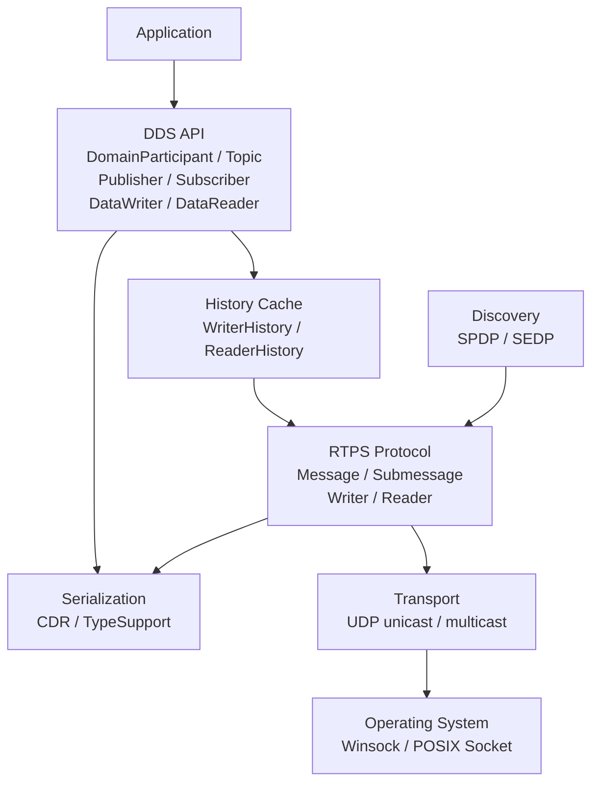

# mini_dds 架构设计

## 1. 项目目标

mini_dds 是一个用于学习 DDS 与 RTPS 的小型实现。项目优先保证协议边界清晰、代码可测试、演进过程可观察，而不是一次性覆盖完整 DDS 规范。

第一个可用版本（MVP）的目标是：

- 支持 Windows 与 Linux 上的 IPv4 UDP 通信；
- 两个进程可以通过固定对端地址发布和订阅一个 Topic；
- 使用 CDR 序列化应用数据；
- 使用 RTPS Message Header 与 DATA Submessage 承载数据；
- 首个版本采用 Best-Effort，不保证丢包重传；
- 每个协议组件都有独立的编解码测试。

后续版本再增加自动发现、可靠传输、QoS 和第三方 DDS 互操作。

## 2. 当前范围与非目标

### 2.1 当前范围

- IPv4 UDP 单播与组播；
- RTPS 2.x 基础消息格式；
- 手写 TypeSupport 和基础 CDR 类型；
- 单进程一个 DomainParticipant；
- 固定对端发布/订阅；
- Best-Effort DataWriter/DataReader；
- SPDP/SEDP 自动发现；
- 最小 Reliable Writer/Reader。

### 2.2 暂不实现

- DDS Security；
- TCP、共享内存等传输；
- 完整 IDL 编译器与代码生成器；
- Persistence、Ownership 等高级 QoS；
- DDS-XTypes 的完整动态类型系统；
- 一开始就追求与所有商业 DDS 实现完全互操作。

## 3. 分层架构



依赖只能自上向下。Transport 不认识 RTPS，RTPS 不依赖具体业务类型，DDS API 不直接操作 Socket。

## 4. 模块职责

### 4.1 `transport`

负责字节数据报的收发，不解析 RTPS 内容。

核心对象：

- `Endpoint`：IP 地址与端口；
- `Datagram`：负载与来源地址；
- `ITransport`：传输层抽象；
- `UdpTransport`：Winsock/POSIX Socket 实现。

约束：

- Socket 对象不可复制，避免重复关闭；
- 接收必须支持超时，不能让上层永久卡死；
- 网络错误通过结构化结果返回；
- 组播加入与退出由传输层管理。

### 4.2 `serialization`

负责 CDR 字节序、对齐和基础类型编解码。

第一阶段支持：

- `uint8/16/32/64`；
- 有符号整数；
- 字符串；
- 原始字节序列；
- Little-Endian 与 Big-Endian。

业务类型通过 `TypeSupport<T>` 转换为 CDR Payload，RTPS 层只处理 Payload 字节。

### 4.3 `rtps`

负责 RTPS 线协议，不提供面向业务的 DDS API。

内部拆分为：

- `types`：GUID、EntityId、SequenceNumber、Locator；
- `message`：RTPS Header、Submessage Header；
- `messages`：DATA、HEARTBEAT、ACKNACK 等具体 Submessage；
- `reader` / `writer`：RTPS 端点状态机；
- `discovery`：SPDP 与 SEDP。

协议解析必须先检查长度、标志位和字节序，再读取字段。任何网络输入都不能假定合法。

### 4.4 `dds`

为应用提供较稳定的接口：

- `DomainParticipant`：持有 Domain、GUID Prefix、传输和发现服务；
- `Topic`：Topic 名与类型名；
- `Publisher` / `Subscriber`：端点容器；
- `DataWriter<T>`：序列化并写入 WriterHistory；
- `DataReader<T>`：从 ReaderHistory 取样并反序列化。

DDS 层负责对象生命周期与配置，网络协议细节不能泄漏到应用接口。

### 4.5 `history` 与 `qos`

`WriterHistory` 保存待发送或待确认的 CacheChange，`ReaderHistory` 保存已接收样本。

首批 QoS：

- Reliability：Best-Effort / Reliable；
- History：KeepLast；
- Durability：Volatile。

在 Best-Effort 路径稳定之前不实现 Reliable，避免状态机与基础数据面同时调试。

## 5. 目录规划

```text
mini_dds/
├── docs/
│   └── architecture.md
├── include/mini_dds/
│   ├── dds/
│   ├── discovery/
│   ├── history/
│   ├── qos/
│   ├── rtps/
│   ├── serialization/
│   └── transport/
├── src/
│   ├── dds/
│   ├── discovery/
│   ├── history/
│   ├── rtps/
│   ├── serialization/
│   └── transport/
├── examples/
└── tests/
```

目录按模块逐步创建，不为尚未设计的模块提交无行为的空类。

## 6. 数据发送流程

```text
Application value
  -> DataWriter<T>::write
  -> TypeSupport<T>::serialize (CDR)
  -> WriterHistory::add_change
  -> RTPS DATA Submessage
  -> RTPS Message Header
  -> ITransport::send
  -> UDP datagram
```

接收方向执行完全相反的过程：

```text
UDP datagram
  -> RTPS Message validation
  -> Reader endpoint matching
  -> ReaderHistory::add_change
  -> TypeSupport<T>::deserialize
  -> DataReader callback / take
```

## 7. 线程模型

MVP 使用简单且可控的线程模型：

- 一个接收线程负责 UDP 收包；
- 一个事件循环解析消息并分发给 Reader；
- 用户线程调用 `write()`；
- 回调不在持有内部锁时执行；
- 停止时通过有限接收超时退出，不依赖强制终止线程。

后续性能优化可以引入任务队列，但不改变模块边界。

## 8. 标识与端口策略

- 一个 Participant 对应一个 12 字节 `GuidPrefix`；
- 每个 Writer/Reader 使用一个 4 字节 `EntityId`；
- 完整 GUID 为 `GuidPrefix + EntityId`；
- Writer 的每个 CacheChange 使用单调递增 `SequenceNumber`；
- 固定对端阶段允许显式配置 IP 与端口；
- 发现阶段按照 RTPS Domain 端口映射计算内建端点端口。

在获得正式 Vendor ID 之前使用未分配/实验标识，并且不宣称完全互操作。

## 9. 错误处理与可观测性

- 配置错误在创建对象时返回失败；
- 网络超时与网络错误必须区分；
- 协议解析返回明确错误，不允许越界读取；
- 日志至少包含模块、远端地址、EntityId 和 SequenceNumber；
- 测试中可以注入假的 `ITransport`，避免所有测试依赖真实网络。

## 10. 测试策略

### 单元测试

- CDR 对齐、字节序、字符串长度与非法输入；
- RTPS Header/Submessage Header 的已知字节向量；
- DATA、HEARTBEAT、ACKNACK 编解码；
- History 去重、排序与深度限制；
- Reader/Writer 状态机。

### 集成测试

- 本机 UDP loopback；
- 两个进程固定端点发布订阅；
- 丢包、乱序、重复包；
- Participant 自动发现；
- 使用 Wireshark 检查报文字段；
- 最终与 Fast DDS 或 Cyclone DDS 做有限互操作验证。

## 11. 里程碑

### M0：UDP 原型（已完成）

- [x] UDP Socket 创建、绑定、发送、接收；
- [x] sender/receiver 本机通信示例；
- [x] CMake 基础工程。

### M1：可测试的协议地基（本轮）

- [x] 跨平台 `ITransport` 与 `UdpTransport`；
- [x] 接收超时和来源地址；
- [x] CDR 基础 Reader/Writer；
- [x] RTPS Message Header 与 Submessage Header；
- [x] 单元测试和 UDP loopback 测试。

### M2：固定端点 Best-Effort 数据面（已完成）

- [x] GUID、EntityId、SequenceNumber 基础行为；
- [x] DATA Submessage 编解码；
- [x] `CacheChange`、WriterHistory、ReaderHistory；
- [x] StatelessWriter/StatelessReader；
- [x] 固定对端 `DataWriter`/`DataReader` 示例。

验收：subscriber 能收到 publisher 发布的结构化样本，而不是裸字符串 UDP 包。

### M3：DDS API（已完成最小版本）

- [x] DomainParticipant；
- [x] Topic 与 StringTypeSupport；
- [x] Publisher/Subscriber；
- [x] DataWriter/DataReader；
- [x] RAII 生命周期与资源释放。

当前 M3 有意保留以下限制：

- Topic 名和类型名尚未进入发现数据，固定端口隐式代表一个 Topic；
- 一个 Participant 暂时只应有一个主动收包的 DataReader；
- Writer 必须显式配置远端地址；
- Reliable QoS 会明确返回“不支持”，不会静默降级。

### M4：自动发现

- [ ] UDP 组播；
- [ ] ParameterList；
- [ ] SPDP Participant Discovery；
- [ ] SEDP Endpoint Discovery；
- [ ] Topic 与类型匹配。

### M5：可靠性与 QoS

- [ ] HEARTBEAT、ACKNACK、GAP；
- [ ] Reliable Writer/Reader 状态机；
- [ ] 超时与重传；
- [ ] KeepLast、Volatile 等最小 QoS。

## 12. 完成定义

一个模块只有同时满足以下条件才算完成：

1. 对外接口和依赖方向明确；
2. 正常路径与错误路径都有实现；
3. 编解码具有已知字节测试；
4. 跨平台代码至少能在当前 Windows 工具链编译；
5. 文档中的状态与代码保持一致；
6. 没有依靠无限忙循环或不可停止线程维持运行。

## 13. 规范依据

线协议字段以 OMG [DDSI-RTPS 2.5](https://www.omg.org/spec/DDSI-RTPS/2.5/PDF) 为依据。当前项目只实现规范的一个子集，因此只能描述为“基于 RTPS”，不能宣称完整符合或通过互操作认证。
